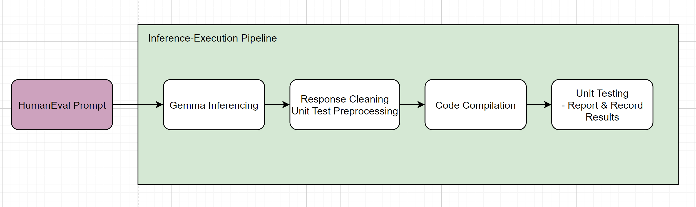
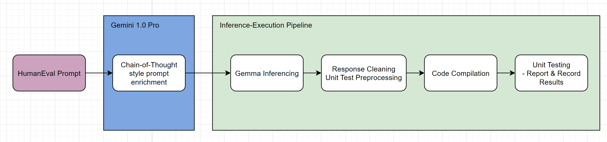
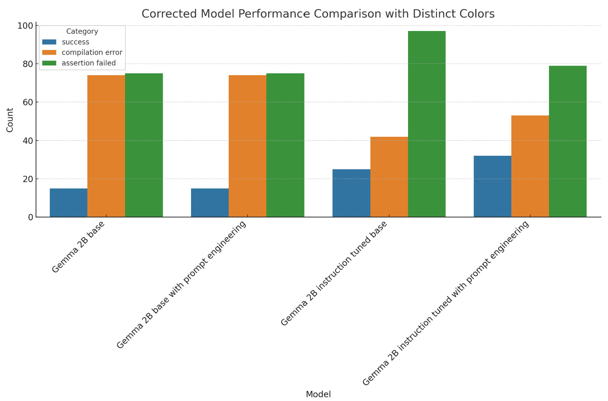
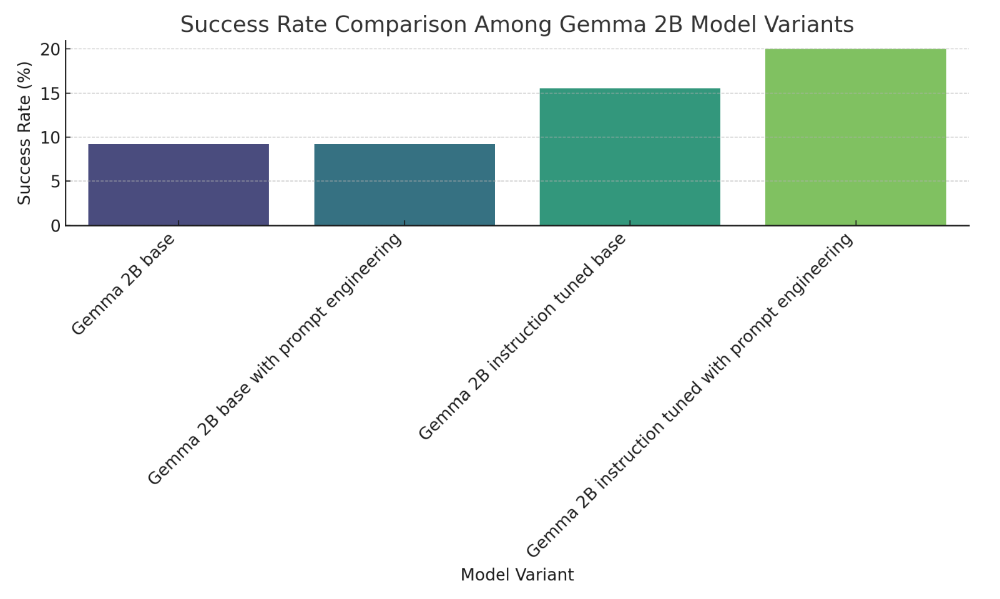

# Google Gemma V.S. HumanEval
Click here for a quick 2-minute [overview](https://drive.google.com/file/d/1Bknv63WwcjpWN_Omb0tbazgEB1706qFb/view?usp=sharing).
## Motivation & Project Goals
- How powerful is prompt engineering? Is it over-hyped?
- How good is gemma on code generation?

Project Goals:
1. Evaluate Gemma's performance on code generation using HumanEval dataset
2. Try to improve Gemma's coding performance using **PROMPT ENGINEERING ONLY.**

## Gemma: "Stats for nerds"
- Decoder-Only model, context length 8192 tokens
- 2B & 7B parameters variant
- Trained on 2T and 6T tokens of primarily-English data from web documents, mathematics, and code
- Outperform other latest models in 11 different metrics

#### Differences between 2B and 7B Variant?
- d_model: 2048 vs 3072
- Attention Mechanisms: Multi-Query vs Multi-Head
- Training Infrastructure: 512 vs 4096 TPUv5e Chips
- Training Data Tokens: 2T vs 6T

## "Instruct" Model?
According to the Gemma Paper: 

"We fine-tune Gemma 2B and 7B with supervised fine-tuning (SFT) on a mix of text-only English-only 
synthetic and human-generated prompt-response pairs and reinforcement learning from human feedback (RLHF) 
with the reward model trained on labelled English-only preference data and the policy based on a set of 
high-quality prompts. We find that both stages are important for improved performance on downstream 
automatic evaluations and human preference evaluations of model outputs."

In other words? It's a **fine-tuned model better at following instructions.**

## HumanEval: Dataset for code generation evaluation
- Released by OpenAI
- 164 Programming Problems
- Written in Python, documented in English

There are 5 columns in this dataset:
1. task_id: ID for the question
2. prompt: Coding question prompt (LLM input)
3. canonical_solution: Sample solution
4. test: Unit tests for the solution
5. entry_point: name of the function to be generated

**Prompt, test, entry_point are what we will focus on.**

## Project Architecture
### Raw HumanEval Prompt Input:

### Prompt-Engineered Input:

### More about Chain-of-Thought style prompt engineering...
- "Step-by-Step thinking"
- Proven to be most effective against logical tasks
- In practice: Incorporate steps/hints to approach a logical problem into prompt
- Handled automatically by Gemini 1.0 Pro in this project

## Code Walkthrough
Refer to jupyter notebooks.

## Results
We ran 4 separate experiments against:
- Gemma 2B, raw HumanEval prompt
- Gemma 2B, prompt-engineered HumanEval prompt
- Gemma 2B Instruct, raw HumanEval prompt
- Gemma 2B Instruct, prompt-engineered HumanEval prompt

#### Performance Comparison

### Observations
1. Prompt engineering does not reflect performance increase on Gemma 2B base at all.
   - Why?
     - End of Sequence (EOS) token missing (comprises 63% of compiler error).
       - 0 EOS issue in instruction fine-tuned Gemma.
     - Bad at following instructions, does NOT understand prompt properly.

2. Performance Increase
   - Gemma 2B base -> Gemma 2B Instruct = +6.3% (68.4% Increase)
   - Gemma 2B Instruct -> Gemma 2B Instruct with PE = +4.5% (29% Increase)
   - Gemma 2B base -> Gemma 2B Instruct with PE = +10.8% (117% Increase)

## Conclusions
1. Fine-Tuning works great, but **do NOT overlook** prompt engineering!
2. Prompt engineering is a **low-cost way to improve model performance, but it works 
better if model is already good at following instructions, or simply more advanced.**
3. Combine Fine-Tuning & Prompt engineering could result in significant improvement in model performance.

## Next Steps
1. Test more prompt engineering techniques!
2. Find out if there is correlation between COT-style prompt engineering and LLM size (parameter count).
    - Does larger model benefit more from prompt engineering?
    - Try same experiment on 7B Gemma variant.

## Relevant Resource/Links
1. Gemma Paper: https://arxiv.org/abs/2403.08295
2. Google AI Studio (Gemini): https://aistudio.google.com  
3. HumanEval Dataset: https://huggingface.co/datasets/openai_humaneval
4. Gemma 2B HuggingFace: https://huggingface.co/google/gemma-2b
5. Refer to top of markdown file for a 2-minute quick overview!

